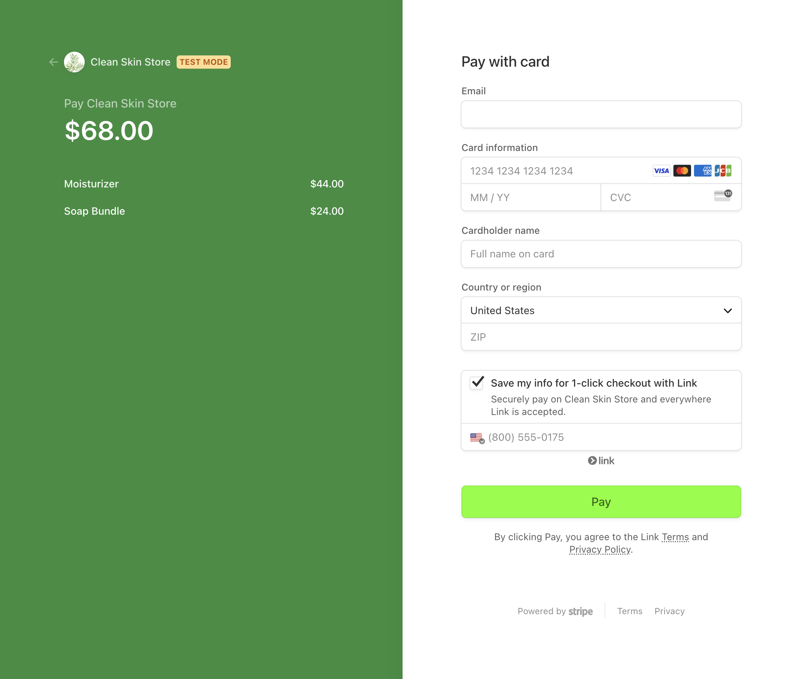
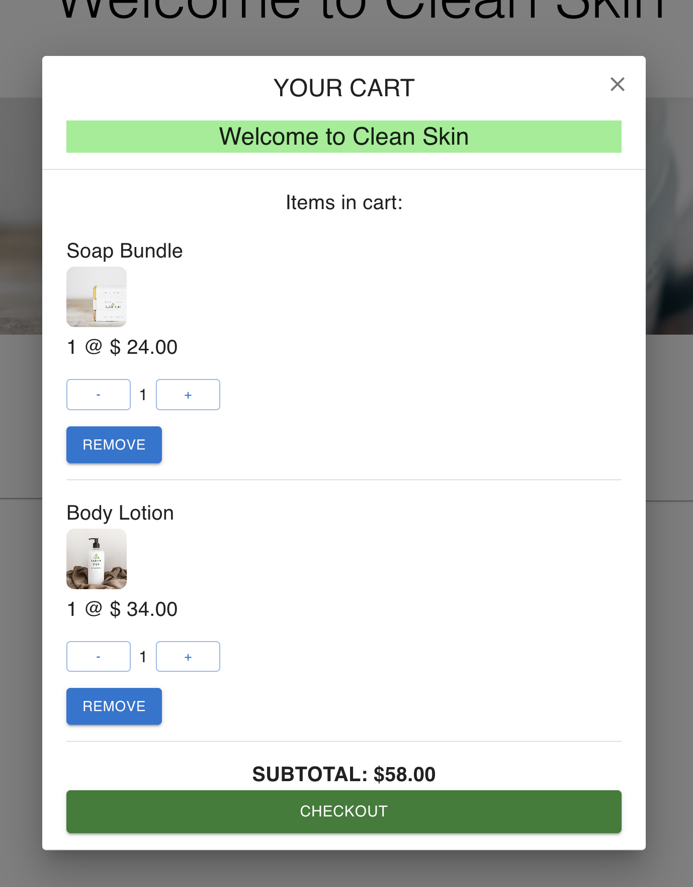

# Shopping Cart & Stripe Payment

## **Description**
This is a shopping cart and Stripe payment using Stripe, React, and MUI.

## **Table of Contents**
* [Installation](#installation)
* [Environment](#environment)
* [Features](#features)
* [Licenses](#licenses)

## Installation
* clone repository
* run npm i to install dependencies
* go to Stripe to get API key
* create .env file and add test key
* start server - node server.js
* start Client app - npm start

## Features
* Stripe payment for checkout
* Material-UI based design
* Adding additional product quantity in cart

### Licenses
MIT license

### *Questions*
If you have any questions, reach out to me on Git Hub https://github.com/JJLindsey, or send me a message jlindsey010@gmail.com.

©Jennifer Lindsey 2024
